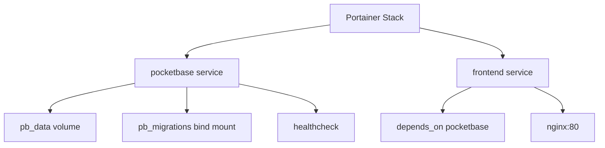
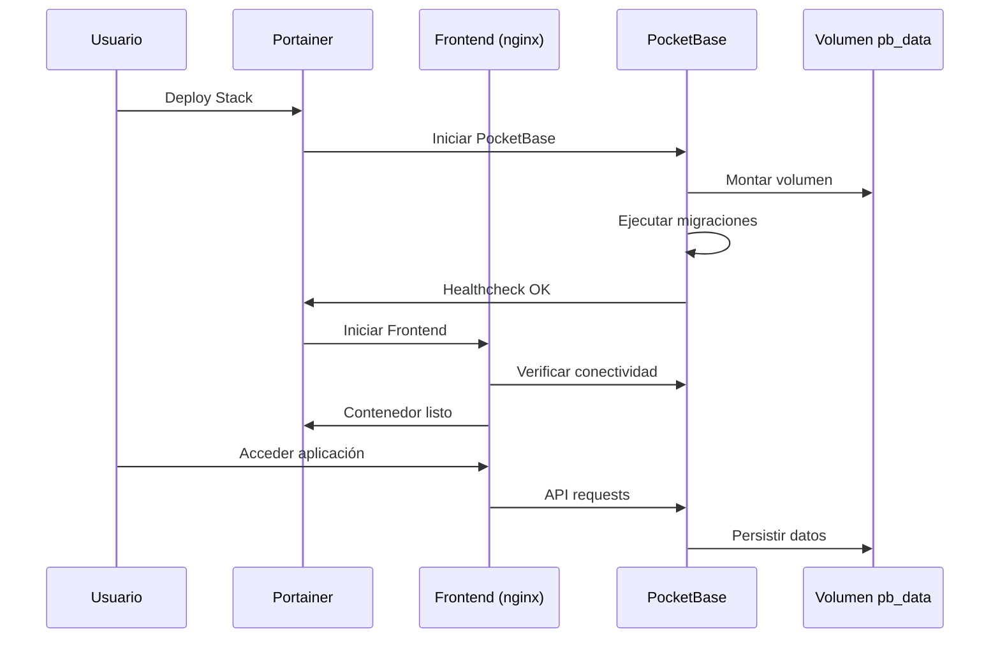

# Despliegue en Portainer para OpenMediaVault

Esta guía detalla el proceso de despliegue del sistema de inventario en un entorno de producción usando Portainer en OpenMediaVault.

## Arquitectura de Producción



## Requisitos Previos

- OpenMediaVault con Docker instalado
- Portainer instalado y accesible
- Acceso SSH al servidor (opcional, para troubleshooting)

## Pasos de Despliegue

### 1. Preparar Archivos

Subir el proyecto completo al servidor OpenMediaVault vía SFTP/SCP.

**Ubicación recomendada:** `/srv/dev-disk-by-uuid-XXX/appdata/inventario`

### 2. Configurar Variables

Ejecutar el script de preparación:

```bash
./deploy-portainer.sh
```

Revisar y ajustar `.env.production` según necesidades. Cambiar puertos si hay conflictos.

Recomendación en OpenMediaVault: mantener el panel de OMV en el puerto 80 y exponer la app en otro puerto (por ejemplo `8080`).

### 3. Crear Stack en Portainer

1. Acceder a la interfaz web de Portainer
2. Ir a "Stacks" → "Add stack"
3. Configurar:
   - **Nombre:** `inventario-mod`
   - **Build method:** "Upload"
   - Subir `docker-compose.prod.yml`
   - En "Environment variables", cargar desde `.env.production`
   - Activar "Auto update" (opcional)

### 4. Configurar Volúmenes

Verificar que el volumen `pb_data` se cree correctamente. Configurar backup automático del volumen en OpenMediaVault.

### 5. Desplegar

1. Hacer click en "Deploy the stack"
2. Monitorear logs en tiempo real
3. Verificar healthcheck de PocketBase

### 6. Acceso Inicial

- **Aplicación Frontend:** `http://<IP_SERVIDOR>:<FRONTEND_PORT>` (por ejemplo `http://192.168.88.2:8080`)
- **PocketBase Admin:** `http://<IP_SERVIDOR>:<POCKETBASE_PORT>/_/`

Crear usuario administrador en PocketBase para el primer acceso.

Tip (recomendado): puedes bootstrapear el superusuario automáticamente configurando en Portainer las variables `PB_ADMIN_EMAIL` y `PB_ADMIN_PASSWORD` (el contenedor las “upsert” en cada arranque).

## Tabla de Puertos y Servicios

| Servicio    | Puerto Interno | Puerto Externo | Protocolo | Descripción          |
|-------------|----------------|----------------|-----------|----------------------|
| Frontend    | 80            | 8080 (recomendado en OMV) | HTTP | Aplicación web React |
| PocketBase  | 8090          | 8090 (configurable) | HTTP | API y Admin UI      |

## Diagrama de Secuencia



## Troubleshooting

- **Verificar logs de contenedores** en Portainer
- **Comprobar conectividad de red** entre servicios
- **Validar permisos de volúmenes**
- **Revisar healthcheck status**

## Actualización del Stack

1. Modificar código fuente
2. En Portainer: "Update the stack" → "Pull and redeploy"
3. O usar Git sync si se configura repositorio

## Backup

Usar el script `backup-pocketbase.sh` para backups del volumen `pb_data`. Programar con cron en OpenMediaVault.

## Consideraciones de Seguridad

- Cambiar `PB_ENCRYPTION_KEY` por un valor seguro aleatorio (debe tener EXACTAMENTE 32 caracteres). Ejemplo: `openssl rand -hex 16`
- No exponer puerto 8090 externamente si no es necesario (usar reverse proxy)
- Configurar firewall en OpenMediaVault para limitar acceso
- Habilitar HTTPS con reverse proxy (Nginx Proxy Manager o Traefik)
- Realizar backups periódicos del volumen `pb_data`
- Actualizar imágenes Docker regularmente